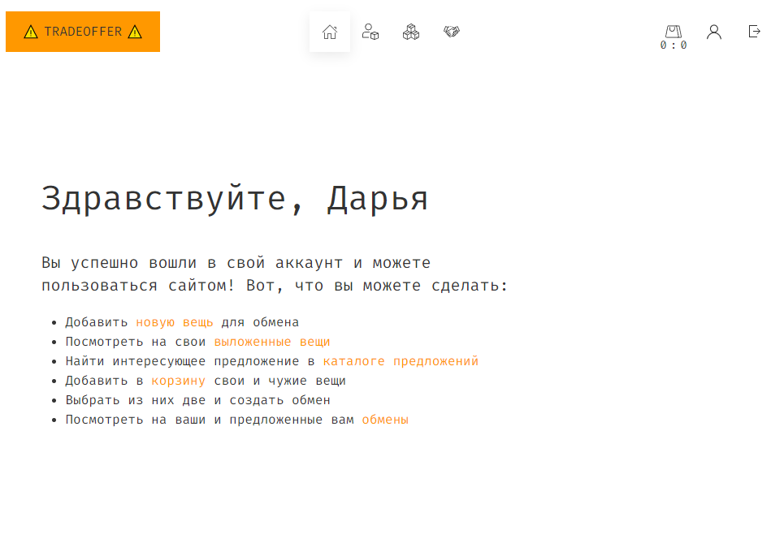
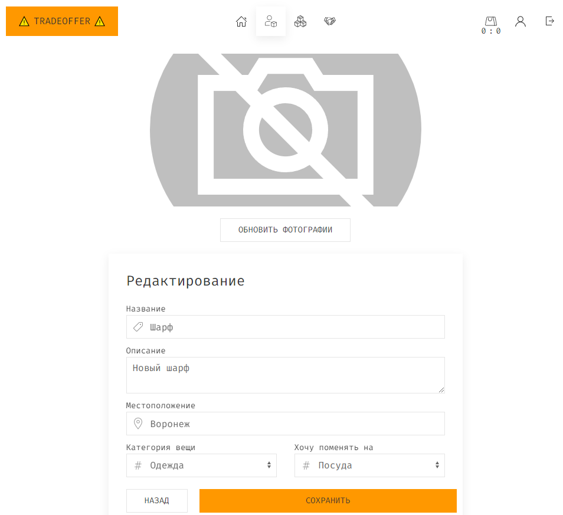

# Лабораторная работа 2

1. [x] Должны быть HEALTHCHECK у контейнеров (реализовать в docker-compose)
2. [x] Переменные окружения должно быть можно переопределить через .env файл. Если такие переменные не найдены - взять значение по умолчанию из docker-compose
3. [x] Приложения внутри подов запущены не под root пользователем
4. [x] Dockerignore должен быть
5. [ ] Идеально будет если вы напишете универсальный докерфайл, который будет собирать или фронт, или бэк, в зависимости от переданных аргументов 
6. [ ] Выставлены ресурсы для контейнеров через cgroups

